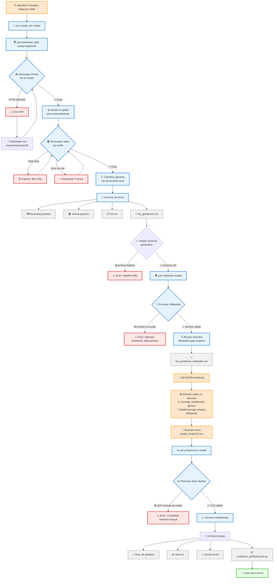

# SCRIPTS de generación de datos para #LasCallesDeLasMujeres

Read this in ENGLISH here: [README.en.md](https://github.com/geochicasosm/data_scripts_lascallesdelasmujeres/blob/master/README.en.md)

Visita la web del proyecto: [#LasCallesDeLasMujeres](https://geochicasosm.github.io/lascallesdelasmujeres/) ( Versión beta ) de [GEOCHICAS](https://geochicas.org/)

## Flujo del proceso de datos



### Comandos principales

- **Proceso completo automatizado**: `just process ciudad relationID`
- **Solo descarga**: `just download_data ciudad relationID`  
- **Solo Wikipedia**: `just wikipedia ciudad`
- **Finalizar**: `just postprocess ciudad`

## Getting Started

Los datos que se visualizan en el proyecto [#LasCallesDeLasMujeres](https://geochicasosm.github.io/lascallesdelasmujeres/) se generan ejecutando los scripts contenidos en este proyecto. A continuación se detallan las instrucciones para reproducir el proceso y poder generar datos para cualquier ciudad.

### Instalación y preparación de entorno

Para poder decargar el proyecto y ejecutar los scripts, es necesario tener instalado:

- GIT (Descargar [AQUí](https://git-scm.com/downloads))
- Node.js versión >=12 (Descargar [AQUí](https://nodejs.org/download/release/v0.12.0/))

Descargar el proyecto:

```
git clone https://github.com/geochicasosm/data_scripts_lascallesdelasmujeres.git
```

Instalación de paquetes:

```
npm install
```

# Instrucciones

### _Paso 1_: identificar la ciudad y su relación en OSM

Buscar [AQUÍ](https://www.openstreetmap.org/relation/11) el ID de OSM de la ciudad a tratar.

Crear una carpeta dentro de la carpeta "data" del proyecto, con el nombre de la ciudad a tratar, en minúsculas y sin espacios. Ejemplos:

**barcelona**

**sanjose**

**buenosaires**

### _Paso 2_: Descargar datos

Ejecutar:

```
npm run initial-step -- --city=nombreciudad --relation=relationID
```

- Ejemplo: **npm run initial-step -- --area=[2.0875,41.2944,2.2582,41.4574] --city=barcelona --relation=347950**

Se generan los ficheros:

- nombreciudad_streets.geojson
- list.csv
- list_genderize.csv

### _Paso 3_: Eliminar calles sin género y buscar enlaces en Wikipedia

Aplicar el script que elimina las calles clasificadas como "unknown" (ni de mujer, ni de hombre) y búsqueda de los articulos de Wikipedia para las calles con nombre de mujer:

```
npm run wikipedia-step -- --city=nombreciudad
```

_\*Para deshabilitar el descarte automático de calles "Unknown" usar el flag `--keepUnknown`_

Se genera el fichero 'list_genderize_wikipedia.csv'.


### _Paso 4_: Revisión manual

Revisar manualmente el fichero anterior:

- Eliminar calles que no son de persona
- Corregir errores en la clasificación male/female. El factor de fiabilidad es 2,-2 (Mujer,Hombre).
- Corregir y añadir enlaces de Wikipedia (las calles con nombre de hombre no necesitan enlace)

---

#### Criterios para eliminar o mantener calles:

Se _ELIMINA_ si:

- Hace alusión a flora o fauna
- Hace alusión a momentos históricos (La Batalla de Pavón)
- Hace alusión a objetos inanimados (Esmeralda = Buque Argentino)

Se _MANTIENE_ si:

- Lleva el nombre de una santa
- Lleva el nombre de una deidad femenina con representación de mujer (Venus)

---

Guardar el fichero corregido en la misma carpeta del proyecto, con el nombre:

**nombreciudad_finalCSV.csv**

_ATENCIÓN_: Es muy importante que el separador de campos utilizado en el CSV sea el ";", en caso contrario no funcionará.

### _Paso 5_

Ejecutar:

```
npm run final-step -- --city=nombreciudad
```

Se generan tres ficheros:

- **final_tile.geojson** Fichero final que se cargará en el mapa
- **stats.txt** fichero con estadísticas de los datos
- **noLinkList.txt** Fichero con el listado de calles sin artículo en wikipedia


### `just` para ejecutar los scripts

Teniendo [just](https://github.com/casey/just) instalado se pueden ejecutar estos pasos de forma más sencilla:

```bash
#Lista los diferentes pasos
$ just -l
just -l                       
Available recipes:
    create_dir city               # Creates the data directory
    download_data city relationID # Downloads the city data from the Overpass API (creating the directory first)
    postprocess city              # Finish the process
    process city relationID       # Run download_data and wikipedia recipe
    wikipedia city                # Enriches the CSV with wikipedia details
---
```

El paso `process` llama automáticamente a los pasos `download_data` y `wikipedia`

```bash
$ just process aldaia 340328
...
```

Y una vez los datos están listos, se puede llamar al paso `postprocess` para acabar el proceso

```bash
just postprocess aldaia       
⚙ Finishing the processing of aldaia
npm run final-step -- --city=aldaia

> lascallesdelasmujeres_data_scripts@1.0.0 final-step
> node ./scripts/parse_final.js --city=aldaia

tar czf data/aldaia.tar.gz data/aldaia
File ready for submission.

👉 data/aldaia.tar.gz 👈

 🌈 Thanks!! 🌈
```

## Para acabar

Haznos llegar los tres ficheros generados y añadiremos tu ciudad al mapa!

---

## Contribuir con el proyecto

Únete a nuestro canal de slack [#lascallesdelasmujeres](https://join.slack.com/t/geochicas-osm/shared_invite/enQtMzIzMzUyMDQyNjczLTU0YjYzNTQ2ZWRkOWQwZGJlNGY4NjhmODY4Y2M2M2Y2MDM3M2EyZTg4NWI0ODY2ZWRhZGIyN2JjMDc0ZDdlODE) si te interesa contribuir.

## Coordinadora Técnica

- **Jessica Sena** (_España_) - [@jsenag](https://jessisena.github.io/myprofile-cra/)
  Ingeniera informática, desarrolladora web/móvil en ámbito geo.

## Licencia

This project is licensed under _CC BY-SA_ License - see the [CC BY-SA](https://creativecommons.org/licenses/by-sa/4.0/) file for details

## Reconocimientos

- [Proyecto](https://blog.mapbox.com/mapping-female-versus-male-street-names-b4654c1e00d5) _Mapping female versus male street names_ de Mapbox por [Aruna Sankaranarayanan](https://www.mapbox.com/about/team/aruna-sankaranarayanan/)

- [Open Street Map](https://www.openstreetmap.org/)

- [Wikipedia API](https://www.mediawiki.org/wiki/API:Main_page/es)

